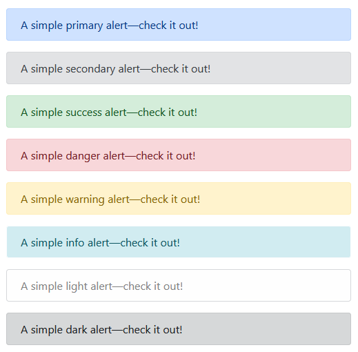

## Alert
Provide contextual feedback messages for typical user actions with the handful of available and flexible alert messages.

Alerts are available for any length of text, as well as an optional dismiss button. For proper styling, use one of the eight `variant`s attribute('primary', 'secondary', 'success', 'danger', 'warning', 'info', 'light', 'dark').



```html
<Alert variant="primary">A simple primary alert—check it out!</Alert>
<Alert variant="secondary">A simple secondary alert—check it out!</Alert>
<Alert variant="success">A simple success alert—check it out!</Alert>
<Alert variant="danger">A simple danger alert—check it out!</Alert>
<Alert variant="warning">A simple warning alert—check it out!</Alert>
<Alert variant="info">A simple info alert—check it out!</Alert>
<Alert variant="light">A simple light alert—check it out!</Alert>
<Alert variant="dark">A simple dark alert—check it out!</Alert>
```

